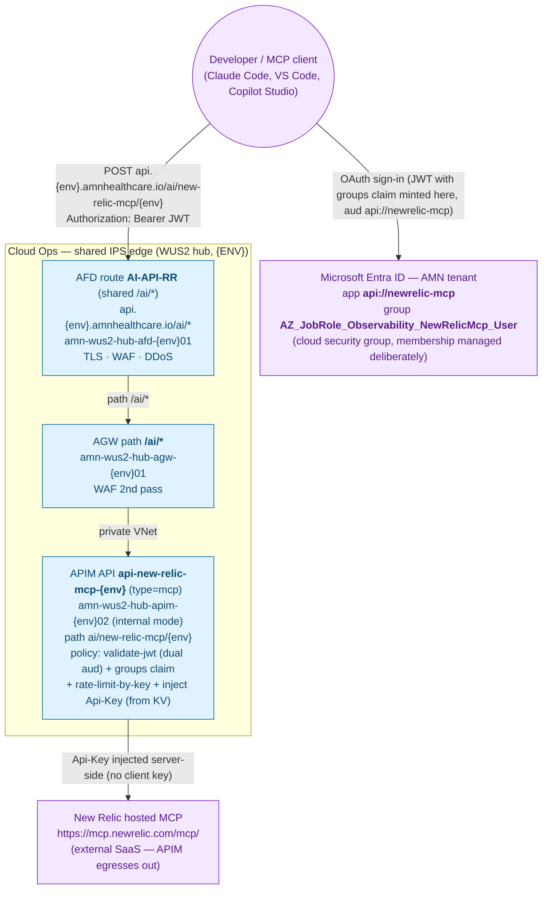

# Topology — New Relic MCP (behind APIM)

End-to-end edge topology for the New Relic MCP gateway, per the AMN **EdgeTopology**
standard (`AFD → AGW → APIM → backend`). This service rides the **existing shared
`AI-API-RR` route** (`/ai/*`) — no new AFD/AGW route is created; only the APIM
`type=mcp` API + policy are added.

- **Client endpoint:** `https://api.{env}.amnhealthcare.io/ai/new-relic-mcp/{env}`
- **APIM API:** `api-new-relic-mcp-{env}` (`type=mcp`, path `ai/new-relic-mcp/{env}`)
- **Backend:** New Relic's hosted MCP (`https://mcp.newrelic.com/mcp/`) — external SaaS

APIM runs in **internal mode** (private IPs only), so the `*.azure-api.net` host is
never client-facing; all ingress is the AFD apex.

**Legend** — blue = Cloud Ops (shared edge); purple = external (identity platform +
external SaaS backend). Arrows are **request hops** (responses retrace the same path
and are omitted). Read/write is not distinguished at the edge or the key — one New
Relic User key covers both; read/write is enforced at the marketplace/skill layer.

## Deviations from the canonical model

- **Backend is external SaaS.** The canonical model reaches backends via a private
  endpoint inside the VNet (`PE → MCP server`). New Relic's MCP is public SaaS, so
  APIM egresses out to `mcp.newrelic.com` — there is no private endpoint. Acceptable
  for a SaaS backend (NR egress is already established for the telemetry pipeline).

## Confirm with the edge team (Preflight)

- The `AI-API-RR` route's `patternsToMatch` is a `/ai/*` wildcard that covers
  `/ai/new-relic-mcp/*` — so this service needs **no** new AFD route or AGW path rule.
- The AGW → APIM health probe uses a **shared** `/liveness` (a `type=mcp` API has no
  per-operation `/liveness`, matching `amn-passport-mcp`).

## Reference

- Canonical model: `amn-ops-ai-plugin-marketplace/plugins/amn-ops-skills/shared/EdgeTopology/README.md`
- Sibling native-MCP precedent on the same APIM: `amn-passport-mcp`
